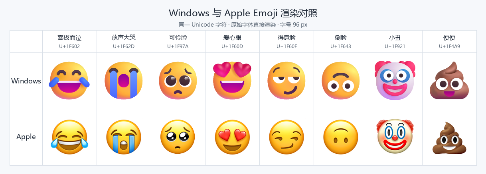

# Apple Emoji Switcher

在 Windows 上使用 Apple 风格 Emoji，保留原生字体备份，随时可以恢复。面向 Windows 10/11 x64，中文界面、解压即用。

v1.3.0 还提供离线增强表情面板：按 **Win + .** 搜索、选择和输入 Emoji 18.0，支持中英文搜索、分类和最近使用。字体管理与面板均已更新界面，继续使用 Windows 自带的 WPF / WinForms。

## 表情效果对比

笑哭、大哭、可怜脸、爱心眼……如果你更喜欢 Apple 的表情风格，可以先看这一组实际渲染对比：

两行使用相同字符和字号，分别从 Windows 11 23H2 的原生 **Segoe UI Emoji** 与本项目固定版本的 **Apple Emoji** 字体渲染，没有重新绘制图案。Windows 版本、应用和字体引擎会影响实际显示；以上不代表所有 Windows 设备的外观。[图片来源与校验信息](docs/images/windows-vs-apple.json)

## 下载 v1.3.0 预览版

从 [GitHub Release](https://github.com/shilittle/AppleEmojiSwitcher/releases/tag/v1.3.0) 下载并解压。每个 ZIP 都提供对应的 `.sha256` 校验文件。

| 版本 | 适合的用途 | 启动 |
| --- | --- | --- |
| [GUI 完整版](https://github.com/shilittle/AppleEmojiSwitcher/releases/download/v1.3.0/AppleEmojiSwitcher-1.3.0.zip) | 中文界面管理字体、补齐原生缺项、检查绘制效果，并包含增强面板 | `启动.vbs` |
| [CLI 极简版](https://github.com/shilittle/AppleEmojiSwitcher/releases/download/v1.3.0/AppleEmojiSwitcher-CLI-1.3.0.zip) | 安装固定苹果原版字体及恢复；约 41 KiB，不需要 Python | `aes.cmd` |
| [Panel 面板版](https://github.com/shilittle/AppleEmojiSwitcher/releases/download/v1.3.0/AppleEmojiSwitcher-Panel-1.3.0.zip) | 只使用离线表情搜索与输入，不改系统字体 | `表情面板.vbs` |

GUI / CLI 包不内置字体，首次安装时按固定来源下载；GUI 另准备私有 Python 和构建依赖。面板包已内置目录和预览图片，使用时无需联网。完整变更见 [更新记录](CHANGELOG.md)。

## 不升级 Windows，使用最新表情面板

1. 解压面板包，双击 `表情面板.vbs` 即可使用。运行期间 Win + . 和 Win + ; 打开增强面板。
2. 需要每次登录自动启用时，运行 `panel.cmd enable`，或在完整 GUI 中点击“启用面板增强”。无需管理员权限或重启。
3. 在目标输入框中按 Win + .，搜索表情，点击或按 Enter 输入。支持中文、英文、码位、分类及最新 Emoji 筛选。
4. 托盘菜单可退出或打开 Windows 原生面板。`panel.cmd disable` 停用并取消登录启动；`panel.cmd uninstall` 删除面板组件，保留字体与恢复备份。

面板包含 Unicode Emoji 18.0 的 **3,963 个完整序列**，其中 19 项为 18.0 新增。离线预览采用 Apple 优先、Noto 补齐；点击输入标准 Unicode 字符。目标应用的字体决定正文外观，因此旧字体仍可能显示缺字或拆开的组合。面板预览不会替目标应用升级字体。

这是独立增强面板，未修改 Windows 原生面板的内部目录。剪贴板历史、GIF 和颜文字可从保留的原生面板入口使用。向管理员应用输入可能被 Windows 阻止，此时可手动点击“复制”。详见 [面板使用说明](docs/PANEL.md) 和 [验证记录](docs/PANEL-VALIDATION.md)。

## GUI 使用

1. 解压完整发布包，双击 `启动.vbs`。
2. 点击“一键替换”，等待资源检查、字体构建和 Windows 实际绘制检查完成。
3. 在 UAC 提示中允许管理员操作；界面显示“待重启”后，保存工作并重启电脑。
4. 重启后重新打开工具验证显示，并用随包的 `应用显示验收.html` 在 Edge、记事本和 Win＋句号输入后的正文中核对效果。

工具不会自动重启。重启前可点击“取消待重启操作”；已经替换后可点击“恢复原生”，然后再次重启。恢复流程使用本机备份，可离线执行。

GUI 与 CLI 共用约 245 MiB 的字体缓存。缓存位于 `%LOCALAPPDATA%\AppleEmojiSwitcher\cache`，原始备份和事务资料位于 `%ProgramData%\AppleEmojiSwitcher`。工具不修改全局 Python、PATH 或系统代理。

CLI 能恢复 GUI 已安装的字体，重复安装不会替换现有模式。切换完整／极简模式时，先恢复原生并重启。

如果旧版首次运行出现 `ExternalDrift`，更新后重新运行 `aes.cmd status`：v1.2.1 修复了原生字体注册为完整路径或可展开路径时的误报。若仍提示外部改动，请保留原始备份并提供完整状态输出；Windows 更新、其他字体工具改动或安装记录缺失需要按实际哈希判断，不能通过删除备份消除报错。

## 兼容性说明

GUI 使用 Apple 优先规则，补齐本机原生支持的缺项，检查 Unicode Emoji 17.0 的肤色、国旗、键帽、性别和 ZWJ 组合。CLI 直接使用上游原版字体，不进行这些加工。

本机对英格兰、苏格兰、威尔士三面地区旗存在 Windows 布局差异，可能显示为黑旗。该局部差异只产生警告，默认不阻止替换。字体损坏、校验失败、备份失败或事务无法恢复时仍会停止。

应用自己附带的表情图片不受系统字体替换影响；不同应用的字体引擎也可能造成显示差异。详细数字、证据和限制见 [VALIDATION.md](VALIDATION.md)，固定来源见 [SOURCES.md](SOURCES.md)，第三方组件说明见 [THIRD_PARTY.md](THIRD_PARTY.md)。

## 目录

- `AppleEmojiSwitcher.ps1`、`启动.vbs`：GUI 入口；`aes.cmd`：CLI 入口
- `builder`、`lib`、`native`：字体构建、系统事务和 Windows 渲染代码
- `tests`：自动化测试
- `docs`：公开验证摘要
- `scripts/package.py`：运行 `python scripts/package.py --variant all` 生成 GUI、CLI、Panel 三版 ZIP 及 SHA-256
- `scripts/generate-readme-comparison.py`：从指定字体生成 README 对比图，不修改系统字体

本工具只面向 Windows 10/11 x64。请保留发布包的目录结构，并在修改系统字体前保存未完成的工作。
